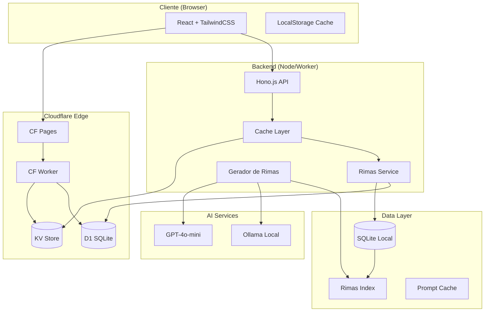
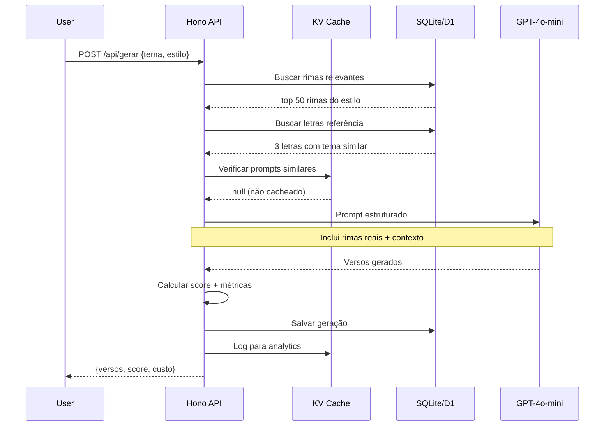

# Arquitetura IA de Rimas Brasil

## Status Atual

| Componente | Estado | Dados |
|------------|--------|-------|
| SQLite | 185 letras, 8.543 rimas, 3 artistas |
| Frontend | React + TailwindCSS (Vite) |
| Backend | Hono.js (mock hardcoded) |
| Cache | Nenhum |
| IA | Templates estáticos |

---

## 1. Diagrama de Arquitetura



---

## 2. Schema de APIs

### 2.1 Endpoints Core

```yaml
# Letras (CRUD + Search)
GET  /api/letras
  params: ?limit=20&offset=0&estilo=agressivo&artista_id=1
  response: { data: Letra[], total: number, hasMore: boolean }
  cache: KV 5min

GET  /api/letras/:id
  response: Letra
  cache: KV 1h

GET  /api/letras/search
  params: ?q=mandume&campo=titulo|letra
  response: { results: Letra[], count: number }
  cache: KV 10min

# Rimas (Busca e Análise)
GET  /api/rimas
  params: ?palavra=amor&tipo=perfeita&limit=50
  response: { rimas: Rima[], total: number }
  cache: KV 30min (alta taxa de hit)

GET  /api/rimas/palavra/:palavra
  response: { matches: Rima[], sugestoes: string[] }
  cache: KV 1h

POST /api/rimas/analisar
  body: { texto: string }
  response: { rimas: Rima[], metricas: Metricas }
  cache: hash(texto) -> KV 24h

# Gerador IA
POST /api/gerar
  body: {
    tema: string,
    estilo: "agressivo" | "tecnico" | "filosofico" | "romantico",
    palavras_chave?: string[],
    num_versos?: 4 | 8 | 16,
    usar_referencia?: boolean
  }
  response: {
    versos: string[],
    rimas_usadas: Rima[],
    referencias: Letra[],
    score: number,
    tokens_usados: number,
    custo_estimado: number
  }
  cache: NONE (sempre novo)

POST /api/gerar/continuar
  body: { verso_anterior: string, direcao: string }
  response: { proximo_verso: string, opcoes: string[] }

# Stats & Dashboard
GET  /api/stats
  response: {
    total_letras: number,
    total_rimas: number,
    total_geradas: number,
    rimas_por_tipo: Record<string, number>,
    top_palavras: { palavra: string, count: number }[]
  }
  cache: KV 15min

GET  /api/stats/custo
  response: {
    requests_hoje: number,
    tokens_hoje: number,
    custo_hoje: number,
    media_por_request: number
  }
```

### 2.2 Types (TypeScript)

```typescript
interface Letra {
  id: number;
  genius_id: number;
  artista_id: number;
  titulo: string;
  letra: string;
  url: string;
  views: number;
  release_date: string;
  estilo: "agressivo" | "tecnico" | "filosofico" | "romantico" | "indefinido";
  qualidade: number;
  versos_total: number;
  palavras_total: number;
  temas: string[];
  created_at: string;
}

interface Rima {
  id: number;
  letra_id: number;
  palavra1: string;
  palavra2: string;
  verso1: string;
  verso2: string;
  tipo: "perfeita" | "consoante" | "toante" | "interna";
  score: number;
}

interface RimaGerada {
  id: string;
  versos: string[];
  tema: string;
  estilo: string;
  score: number;
  referencias: number[];  // letra_ids
  tokens: number;
  custo: number;
  created_at: string;
}

interface Metricas {
  rimas_por_verso: number;
  densidade_rima: number;
  variedade_vocabular: number;
  complexidade: number;
}
```

---

## 3. Estratégia de Cache

### 3.1 Arquitetura de Cache em Camadas

```
┌─────────────────────────────────────────────────────────────┐
│ L1: Browser LocalStorage (1MB)                              │
│     - Últimas 10 buscas de rimas                            │
│     - Últimas 5 rimas geradas                               │
│     - Stats dashboard (5min TTL)                            │
└─────────────────────────────────────────────────────────────┘
                              ↓
┌─────────────────────────────────────────────────────────────┐
│ L2: Cloudflare KV (Global Edge)                             │
│     - Rimas por palavra (1h TTL, 30min stale-while-revalidate)
│     - Letras populares (1h TTL)                             │
│     - Stats agregados (15min TTL)                           │
│     - Prompts de geração (24h TTL, hash-based)              │
└─────────────────────────────────────────────────────────────┘
                              ↓
┌─────────────────────────────────────────────────────────────┐
│ L3: SQLite/D1 (Source of Truth)                             │
│     - Todas as letras e rimas                               │
│     - Histórico de gerações                                 │
│     - Métricas de uso                                       │
└─────────────────────────────────────────────────────────────┘
```

### 3.2 Cache Keys Pattern

```typescript
const CACHE_KEYS = {
  // Rimas
  rimas_palavra: (p: string) => `rimas:v1:palavra:${p.toLowerCase()}`,
  rimas_tipo: (t: string) => `rimas:v1:tipo:${t}`,

  // Letras
  letra: (id: number) => `letra:v1:${id}`,
  letras_list: (page: number, estilo?: string) =>
    `letras:v1:list:${page}:${estilo || 'all'}`,

  // Search
  search: (q: string) => `search:v1:${hash(q)}`,

  // Stats
  stats_global: () => `stats:v1:global`,
  stats_custo: (date: string) => `stats:v1:custo:${date}`,

  // Geracao (não cacheia, mas loga)
  geracao_log: (id: string) => `gen:v1:${id}`,
};
```

### 3.3 TTL Strategy

| Recurso | TTL | Stale-While-Revalidate | Justificativa |
|---------|-----|------------------------|---------------|
| Rimas/palavra | 1h | 30min | Alta taxa de hit, dados estáticos |
| Letras | 24h | 1h | Quase nunca muda |
| Search | 10min | 5min | Padrões de busca variam |
| Stats | 15min | 5min | Precisa ser atual |
| Geração | NONE | - | Sempre único |

### 3.4 Invalidação

```typescript
// Eventos que invalidam cache
const INVALIDATION_TRIGGERS = {
  'letra.created': ['letras:*', 'stats:*'],
  'letra.updated': ['letra:{id}', 'letras:*'],
  'rima.created': ['rimas:*'],
  'daily': ['stats:custo:*']  // cron job
};
```

---

## 4. Sistema de Geração de Rimas

### 4.1 Pipeline de Geração



### 4.2 Prompt Engineering

```typescript
const buildPrompt = (params: GerarParams, context: Context) => `
Você é um MC brasileiro especialista em batalhas de rima.

CONTEXTO:
- Tema: ${params.tema}
- Estilo: ${params.estilo}
- Versos: ${params.num_versos || 8}

RIMAS DISPONÍVEIS (use como inspiração):
${context.rimas.map(r => `• ${r.palavra1} / ${r.palavra2}`).join('\n')}

REFERÊNCIAS DE LETRAS REAIS:
${context.letras.map(l => `
[${l.titulo}]
${l.letra.slice(0, 500)}...
`).join('\n---\n')}

REGRAS:
1. Use português brasileiro coloquial
2. Mantenha o flow natural de batalha
3. Rimas devem ser no mínimo consoantes (últimas 2 letras)
4. Evite clichês como "coração/paixão"
5. Score de complexidade > 7.0

RESPONDA APENAS COM OS VERSOS, um por linha:
`;
```

### 4.3 Sistema de Score

```typescript
interface ScoreCalculation {
  rima_qualidade: number;      // 0-10 (tipo de rima)
  originalidade: number;       // 0-10 (distância do corpus)
  flow: number;               // 0-10 (métrica silábica)
  complexidade_vocabular: number; // 0-10 (palavras incomuns)
  coerencia_tematica: number; // 0-10 (aderência ao tema)

  final: number;              // média ponderada
}

const PESOS = {
  rima_qualidade: 0.25,
  originalidade: 0.20,
  flow: 0.20,
  complexidade_vocabular: 0.15,
  coerencia_tematica: 0.20,
};
```

---

## 5. Plano de Migração para Cloudflare D1

### 5.1 Fases

```
┌──────────────────────────────────────────────────────────────┐
│ FASE 1: Preparação (Local)                                   │
│ • Validar schema SQLite compatível com D1                    │
│ • Criar índices otimizados                                   │
│ • Implementar abstração de DB (SQLite <-> D1)                │
│ • Testes de integração                                       │
└──────────────────────────────────────────────────────────────┘
                              ↓
┌──────────────────────────────────────────────────────────────┐
│ FASE 2: Deploy D1 (Staging)                                  │
│ • Criar D1 database: wrangler d1 create rimas-db             │
│ • Migrar schema: wrangler d1 migrations apply                │
│ • Importar dados: wrangler d1 execute --file=dump.sql        │
│ • Validar contagem de registros                              │
└──────────────────────────────────────────────────────────────┘
                              ↓
┌──────────────────────────────────────────────────────────────┐
│ FASE 3: Worker + KV (Staging)                                │
│ • Criar KV namespace: wrangler kv namespace create RIMAS     │
│ • Deploy Worker com bindings D1 + KV                         │
│ • Testar todas as APIs                                       │
│ • Benchmark de latência                                      │
└──────────────────────────────────────────────────────────────┘
                              ↓
┌──────────────────────────────────────────────────────────────┐
│ FASE 4: Cutover (Produção)                                   │
│ • Feature flag: USE_D1=true                                  │
│ • Rollout gradual: 10% -> 50% -> 100%                        │
│ • Monitorar erros e latência                                 │
│ • Deprecar endpoint Node local                               │
└──────────────────────────────────────────────────────────────┘
```

### 5.2 Wrangler Config Final

```jsonc
// wrangler.jsonc
{
  "name": "ia-rimas-brasil",
  "main": "src/worker.ts",
  "compatibility_date": "2024-01-01",
  "node_compat": true,

  "d1_databases": [
    {
      "binding": "DB",
      "database_name": "rimas-db",
      "database_id": "<gerado>"
    }
  ],

  "kv_namespaces": [
    {
      "binding": "CACHE",
      "id": "<gerado>"
    }
  ],

  "vars": {
    "OPENAI_API_KEY": "<secret>",
    "ENVIRONMENT": "production"
  }
}
```

### 5.3 Abstração de Database

```typescript
// src/db/index.ts
interface DBAdapter {
  query<T>(sql: string, params?: any[]): Promise<T[]>;
  execute(sql: string, params?: any[]): Promise<{ changes: number }>;
}

// SQLite Local (dev)
class SQLiteAdapter implements DBAdapter {
  constructor(private db: BetterSqlite3.Database) {}

  async query<T>(sql: string, params?: any[]): Promise<T[]> {
    return this.db.prepare(sql).all(...(params || [])) as T[];
  }
}

// Cloudflare D1 (prod)
class D1Adapter implements DBAdapter {
  constructor(private db: D1Database) {}

  async query<T>(sql: string, params?: any[]): Promise<T[]> {
    const result = await this.db.prepare(sql).bind(...(params || [])).all();
    return result.results as T[];
  }
}

// Factory
export const createDB = (env: Env): DBAdapter => {
  if (env.DB) return new D1Adapter(env.DB);  // Cloudflare
  return new SQLiteAdapter(require('better-sqlite3')('./data/rimas.db'));
};
```

---

## 6. Estimativa de Custos

### 6.1 GPT-4o-mini Pricing

| Métrica | Valor |
|---------|-------|
| Input | $0.15 / 1M tokens |
| Output | $0.60 / 1M tokens |
| Contexto médio (prompt) | ~800 tokens |
| Output médio (8 versos) | ~150 tokens |

### 6.2 Custo por Request de Geração

```
Prompt (contexto + rimas + refs): ~800 tokens input
Output (8 versos):                ~150 tokens output

Custo = (800 × $0.00000015) + (150 × $0.0000006)
      = $0.00012 + $0.00009
      = $0.00021 por request
      ≈ R$ 0,0012 por request (câmbio 5.7)
```

### 6.3 Projeção de Uso

| Cenário | Requests/dia | Custo/dia | Custo/mês |
|---------|--------------|-----------|-----------|
| Baixo | 100 | $0.02 | $0.60 |
| Médio | 1.000 | $0.21 | $6.30 |
| Alto | 10.000 | $2.10 | $63.00 |

### 6.4 Cloudflare Costs

| Serviço | Free Tier | Custo Adicional |
|---------|-----------|-----------------|
| Workers | 100k req/dia | $0.50/1M req |
| KV | 100k reads, 1k writes/dia | $0.50/1M reads |
| D1 | 5M rows read, 100k write/dia | $0.75/1M reads |
| Pages | Ilimitado | Grátis |

### 6.5 Custo Total Estimado (Médio)

```
GPT-4o-mini:     $6.30/mês
Workers:         $0.00/mês (free tier)
KV:              $0.00/mês (free tier)
D1:              $0.00/mês (free tier)
─────────────────────────────
TOTAL:           ~$6.30/mês (~R$ 36)
```

---

## 7. Checklist de Implementação

### Fase 1: Conectar SQLite (1-2 dias)
- [ ] Criar `src/services/database.ts` com adapter
- [ ] Atualizar `src/index.tsx` para usar DB real
- [ ] Remover dados hardcoded
- [ ] Testar endpoints `/api/letras` e `/api/rimas`

### Fase 2: Cache Layer (1 dia)
- [ ] Criar `src/services/cache.ts`
- [ ] Implementar cache em memória para dev
- [ ] Adicionar headers Cache-Control
- [ ] Testar invalidação

### Fase 3: Gerador IA (2-3 dias)
- [ ] Criar `src/services/generator.ts`
- [ ] Integrar OpenAI SDK
- [ ] Implementar prompt engineering
- [ ] Sistema de score
- [ ] Rate limiting

### Fase 4: Migração D1 (1-2 dias)
- [ ] Setup wrangler D1
- [ ] Migrar schema
- [ ] Importar dados
- [ ] Deploy Worker
- [ ] Testes E2E

---

## 8. Riscos e Mitigações

| Risco | Impacto | Mitigação |
|-------|---------|-----------|
| Rate limit OpenAI | Alto | Queue + retry exponential |
| D1 limites de escrita | Médio | Batch writes, cache agressivo |
| Custo GPT escalar | Médio | Limitar requests/user/dia |
| Latência D1 | Baixo | KV cache na frente |
| Qualidade rimas | Médio | Few-shot prompting, human feedback |

---

*Documento gerado em 2026-01-08*
*Arquiteto: Claude Code*
